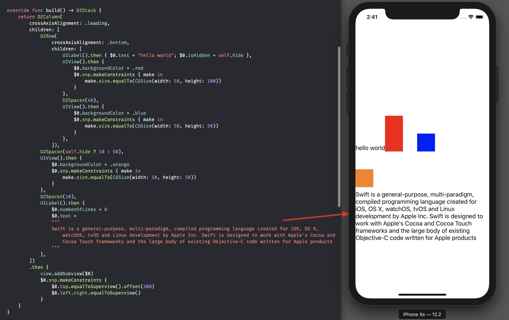

# DeclarativeSugar

a Flutter-like declarative UI syntax sugar  base on Swift and UIStackView

## Feature



- [x] Declarative UI
- [x] Hide UIStackView complexity, use Flutter-ish API instead
- [x] Support composable view-hierachy as same as UIStackView
- [x] Support "Full Rebuild" and "Incremental Update"
- [x] Support Animation except "Full Rebuild"

## Depolyment & Dependency

iOS 9, UIKit

But I would like to recommend [Then](https://github.com/devxoul/Then) to write more concise UI setup code

## Usage

### 1. inherite `DeclarativeViewController`

``` swift
class ViewController: DeclarativeViewController {
...
```

### 2. provide your own view-hierachy

``` swift
override func build() -> DZStack {
    return DZColumn(
            crossAxisAlignment: .leading,
            children: [
                DZRow(
                    crossAxisAlignment: .bottom,
                    children: [
                        UILabel().then { $0.text = "hello world"; $0.isHidden = self.hide },
                        UIView().then {
                            $0.backgroundColor = .red
                            $0.snp.makeConstraints { make in
                                make.size.equalTo(CGSize(width: 50, height: 100))
                            }
                        },
                        DZSpacer(40),
                        UIView().then {
                            $0.backgroundColor = .blue
                            $0.snp.makeConstraints { make in
                                make.size.equalTo(CGSize(width: 50, height: 50))
                            }
                        },
                    ]),
                DZSpacer(self.hide ? 10 : 50),
                UIView().then {
                    $0.backgroundColor = .orange
                    $0.snp.makeConstraints { make in
                        make.size.equalTo(CGSize(width: 50, height: 50))
                    }
                },
                DZSpacer(10),
                UILabel().then {
                    $0.numberOfLines = 0
                    $0.text =
                    """
                    Swift is a general-purpose, multi-paradigm, compiled programming language created for iOS, OS X, watchOS, tvOS and Linux development by Apple Inc. Swift is designed to work with Apple's Cocoa and Cocoa Touch frameworks and the large body of existing Objective-C code written for Apple products
                    """
                },
            ])
            .then {
                view.addSubview($0)
                $0.snp.makeConstraints {
                    $0.top.equalToSuperview().offset(300)
                    $0.left.right.equalToSuperview()
                }
        }
}
```

### 3. Update state (full rebuild without animation)

``` swift
override func touchesBegan(_ touches: Set<UITouch>, with event: UIEvent?) {
        self.rebuild {
            self.hide = !self.hide
        }
    }
```

### 4. Update state (incremental with animation)

note: first of all, abstract target controls to local variables

``` swift
override func touchesBegan(_ touches: Set<UITouch>, with event: UIEvent?) {
        UIView.animate(withDuration: 0.5) {
            // incremental reload
            self.hide = !self.hide
            self.context.setSpacing(self.hide ? 50 : 10, for: self.spacer)
            self.context.setHidden(self.hide, for: self.label)
        }
    }
```

## Example

To run the example project, clone the repo, and run `pod install` from the Example directory first.

## Requirements

## Installation

DeclarativeSugar is available through [CocoaPods](https://cocoapods.org). To install
it, simply add the following line to your Podfile:

```ruby
pod 'DeclarativeSugar'
```

## Author

Darren Zheng 623767307@qq.com

## License

DeclarativeSugar is available under the MIT license. See the LICENSE file for more info.
