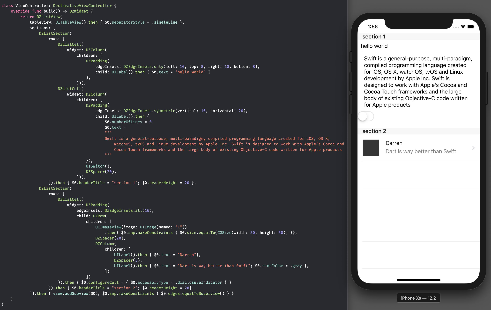
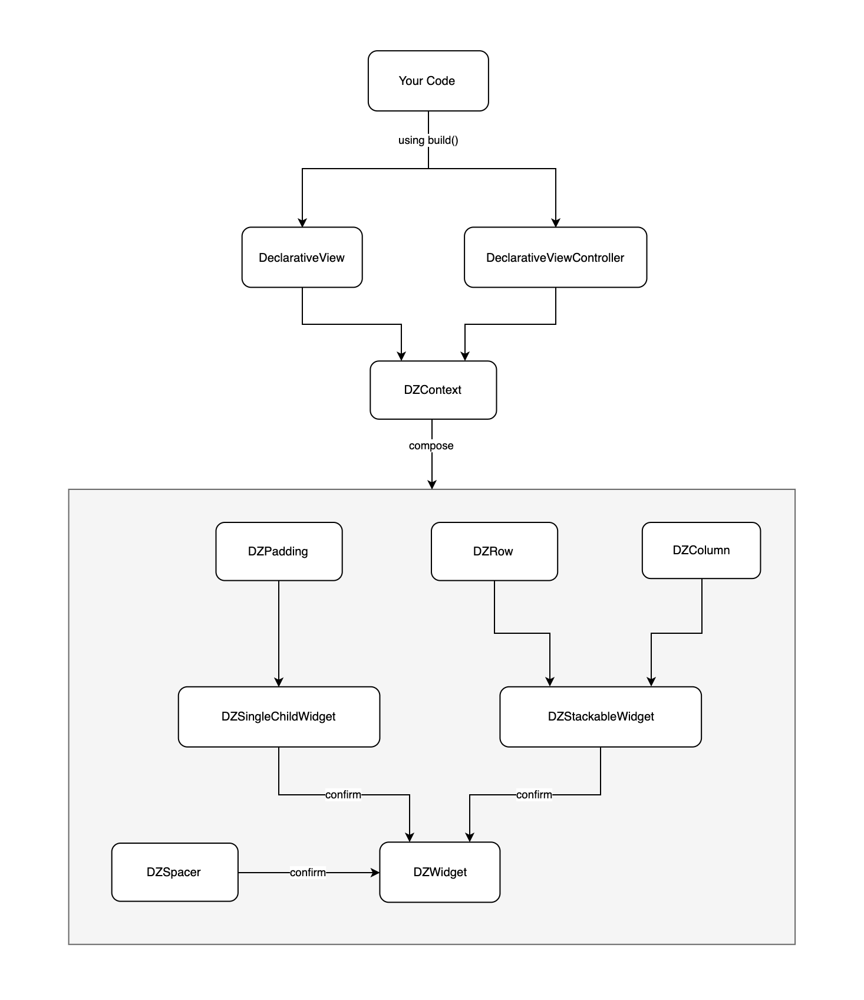

# DeclarativeSugar

> 
> a Flutter-like declarative syntax sugar based on Swift and UIStackView
> 



## Feature List

- [x] Declarative UI
- [x] Hide `UIStackView` complexity, use Flutter-ish API instead
- [x] Support composable view-hierachy as same as `UIStackView`
- [x] Support entry point `build()` and update method `rebuild()`   
- [x] Support `Row/Column`, `Spacer` (`sizedBox` in Flutter)
- [x] Supoort `ListView` (`UITableView` in UIKit) 2019-08-03
- [x] Support `Padding` 2019-08-05

**Depolyment**: iOS 9, Swift 5  
**Dependency**: UIKit (*nothing else*)  

But I would suggest using [Then](https://github.com/devxoul/Then) for writing cleaner initializer.

## Setup

### Inherite `DeclarativeViewController` or `DeclarativeView`

``` swift
class ViewController: DeclarativeViewController {
    ...
}
```

### Provide your own view-hierachy

``` swift
override func build() -> DZWidget {
    return ...
}
```

## Widget

### Row

Layout views horizontally

``` swift
DZRow(
    mainAxisAlignment: ... // UIStackView.Distribution
    crossAxisAlignment: ... // UIStackView.Alignment
    children: [
       ...
    ])
```

### Column

Layout views vertically

``` swift
DZColumn(
    mainAxisAlignment: ... // UIStackView.Distribution
    crossAxisAlignment: ... // UIStackView.Alignment
    children: [
       ...
    ])
```

### Padding

Set padding for child Widget

#### only

``` swift
 DZPadding(
    edgeInsets: DZEdgeInsets.only(left: 10, top: 8, right: 10, bottom: 8),
    child: UILabel().then { $0.text = "hello world" }
 ),
```

#### symmetric

``` swift
 DZPadding(
    edgeInsets: DZEdgeInsets.symmetric(vertical: 10, horizontal: 20),
    child: UILabel().then { $0.text = "hello world" }
 ),
```

#### all

``` swift
 DZPadding(
    edgeInsets: DZEdgeInsets.all(16),
    child: UILabel().then { $0.text = "hello world" }
 ),
```

## Spacer

For `Row`: it is a `SizedBox` with width value.

```
DZRow(
    children: [
        ...
        DZSpacer(20), 
        ...
    ]
)
```

For `Column`: it is a `SizedBox` with height value.

```
DZColumn(
    children: [
        ...
        DZSpacer(20), 
        ...
    ]
)
```

## ListView

Generally, you don't need delegate/datasource pattern and UITableViewCell

```
 DZListView(
    tableView: UITableView().then { $0.separatorStyle = .singleLine },
    sections: [
        DZListSection(
            rows: [
                DZListCell(
                    widget: ...,
                DZListCell(
                    widget: ...,
            ]).then { $0.headerTitle = "section 1"; $0.headerHeight = 20 }, // setup section header/footer
        DZListSection(
            rows: [
                DZListCell(widget: ...).then { $0.configureCell = { $0.accessoryType = .disclosureIndicator } } // setup cell
            ])
    ]).then { view.addSubview($0); $0.snp.makeConstraints { $0.edges.equalToSuperview() } }
```


## Rebuild

### Update state (reset)

``` swift
self.rebuild {
    self.hide = !self.hide
}
```

### Update state (incremental)

``` swift
UIView.animate(withDuration: 0.5) {
    // incremental reload
    self.hide = !self.hide
    self.context.setSpacing(self.hide ? 50 : 10, for: self.spacer)
    self.context.setHidden(self.hide, for: self.label)
}
```

## Code Structure



## Example

To run the example project, clone the repo, and run `pod install` from the Example directory first.

## Installation

DeclarativeSugar is available through [CocoaPods](https://cocoapods.org). To install
it, simply add the following line to your Podfile:

```ruby
pod 'DeclarativeSugar'
```

## Author

Darren Zheng 623767307@qq.com

## License

DeclarativeSugar is available under the MIT license. See the LICENSE file for more info.
